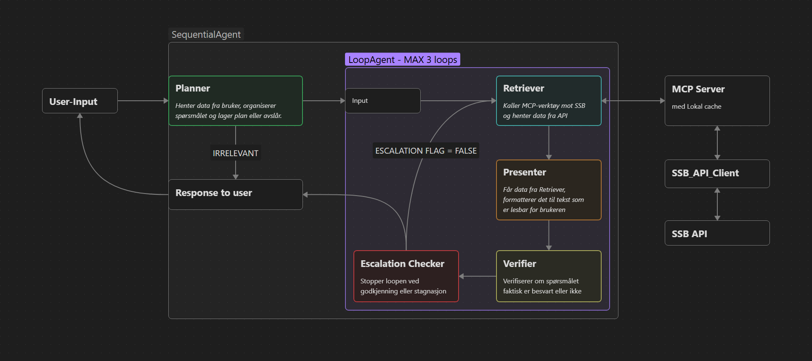

# 2026_1_Yddal_Rammeverk-og-Utvikling
## Mappe-oversikt

| Mappe / Fil | Innhold |
|---|---|
| [Agent_API/](Agent_API/) | Google-ADK Agent API som kobler til MCP-server og gir data til brukere |
| [MCP_server_SSB/](MCP_server_SSB/) | MCP-server som eksponerer SSB-tabell 11656 som tools til agentflyten (Retriever-agenten bruker denne) |
| [Oppgavebesvarelse.md](Oppgavebesvarelse.md) | Problemstilling, agentflyt, og SSB-API-begrensninger |
| [start_all.bat](start_all.bat) | Starter MCP-server, ADK API-server, ADK Web og klient i hver sitt CMD vindu (Windows) |

## Arkitektur — filoversikt

| Fil | Rolle |
|---|---|
| [Agent_API/api/SSB_agent_api/agent.py](Agent_API/api/SSB_agent_api/agent.py) | All agent-logikk, prompts og callbacks |
| [Agent_API/api/client.py](Agent_API/api/client.py) | Referanseimplementasjon for HTTP-integrasjon mot ADK API |
| [Agent_API/api/responses/](Agent_API/api/responses/) | Eksempel-sesjonslogger med fullstendige event-traces |
| [MCP_server_SSB/src/server.py](MCP_server_SSB/src/server.py) | FastMCP-tools (tynt lag) |
| [MCP_server_SSB/src/ssb_client.py](MCP_server_SSB/src/ssb_client.py) | API-klient: URL-bygging, JSON-Stat → næring-nestet konvertering, status-koder, cache (1 time i minnet + disk-dump til `MCP_server_SSB/cache/`) |
| [MCP_server_SSB/src/__init__.py](MCP_server_SSB/src/__init__.py) | Entry point — velger HTTP eller stdio transport |

## Env-vars
**OBS! .env fil er ikke inkludert i gitignore fil. Hvis du skal legge inn Google ADK API keys, så legg filen til i .gitignore.**
| Variabel | Default | Hvor brukes den |
|---|---|---|
| `MCP_SERVER_URL` | `http://127.0.0.1:8000/mcp` | Agent → MCP-server |
| `AGENT_MODEL` | `ollama_chat/qwen2.5` | LLM for alle 4 agenter |
| `OLLAMA_API_BASE` | `http://localhost:11434` | LiteLlm → Ollama |
| `ADK_API_BASE_URL` | `http://127.0.0.1:8001` | client.py → ADK API-server |
| `CLIENT_TIMEOUT_SECONDS` | `600` | client.py /run-timeout |
| `LOG_LEVEL` | `INFO` | MCP-server logging |
| `PORT` | `8000` | MCP-server HTTP-port |
| `USE_CUDA` | `auto` | `auto` detekterer via nvidia-smi; `0`/`1` tvinger CPU/GPU i Ollama-kall |

# Beskrivelse av prosjektet
Vårsemester 2026 — Rammeverk og dataforberedelser / Utvikling av Modeller.

Prosjektet bygger et multi-agent system som svarer på spørsmål om forventet lønn i ulike yrker og næringer, basert på data fra SSBs PxWebApi v2 (tabell 11656).

## Problemstilling

Gi Norges befolkning en enkel måte å se på forventet lønn innenfor markeder eller stillinger som de tenker å søke på.
Prosjektet skal hente inn lønnstatistikk fra SSB for å svar på spørsmål rettet til lønn i forskjellige yrker og markeder.

## Agent-pipeline
```
SequentialAgent: ssb_pipeline
├── planner_agent           — Henter data fra bruker, organiserer spørsmålet og lager plan eller avslår.
└── LoopAgent: retrieval_loop  (maks 3 iterasjoner, skippes hvis IRRELEVANT)
    ├── retriever_agent     — Kaller MCP-verktøy mot SSB og henter data fra API
    ├── presenter_agent     — Får data fra Retriever, formatterer det til tekst som er lesbar for brukeren
    ├── verifier_agent      — Verifiserer om spørsmålet faktisk er besvart eller ikke
    └── escalation_checker  — Stopper loopen ved godkjenning eller stagnasjon
```
**escalation_checker** Avslutter loopen tidlig på to tilfeller: (1) Verifier har godkjent svaret med `OK:`, eller (2) Retriever leverte identisk data to iterasjoner på rad (stagnasjon — ingen vits i å fortsette). Hvis ingen av delene gjelder, fortsetter loopen til maks-antall iterasjoner er nådd.

Alle fire LLM-agenter bruker `ollama_chat/qwen2.5` via LiteLlm som standard.




### Pipeline-styring via Escalate_TAG
For å unngå at hele agent loopen kjøres så settes det eskalerings triggere i første linje fra agentene. Dette ordner det slik at spørsmål går tilbake til bruker hvis informasjonen ikke er relevant eller vi trenger mer informasjon for å hente informasjon.
Planner agent skriver `RELEVANT` eller `IRRELEVANT:` på første linje. `strip_planner_escalate_tag` (`after_model_callback`) fjerner Escalate_TAG-prefikset før teksten yieldes som event, og lagrer `plan_is_relevant` i state. `skip_loop_if_irrelevant` (`before_agent_callback` på loopen) leser flagget og hopper over hele retrieval-loopen ved irrelevante spørsmål — slik unngår vi unødvendige Ollama- og MCP-kall.

Siden `SequentialAgent` ikke kan bruke `actions.escalate` fra sub-agenter, måtte jeg implementere styringen via `before_agent_callback` på loopen heller enn `escalate` metodikken fra planner.

Verifier termineres tidlig via `actions.escalate` når svaret starter med `OK:`. Dette sørger for at loopen kun kjøres så mange ganger som er nødvendig. Hvis verifier agenten finner ut at informasjonen er ikke den som er etterspurt så fortsetter loopen med bedre informasjon til retriever for å hente ny informasjon.

### ADK Web UI (utforsk agent-pipelinen)

ADK Web på `http://127.0.0.1:8080` viser hver sub-agent med state-deltas, tool-kall og rå modellrespons under Events-fanen. **NB**: hverken `adk web` eller `adk api_server` har hot-reload av agent-moduler — restart prosessen etter hver endring i `agent.py`.


## Begrensninger å ta hensyn til fra SSB API:
* Grensene per uttrekk er 800.000 dataceller
* antall spørringer er for tiden 30 per minutt
* Unngå tidsrommet 07.55–08.15.
* Kan være lurt å holde seg unna data i tidsrommet 05-08. Ref: Eksisterende tall som skal revideres kl. 08 vil vises som 0 eller prikk i tidsrommet kl. 05–08
* Metadata oppdateres klokken 05.00 og 11.30, og under disse oppdateringene er tabellene utilgjengelige.

## Eksempel på spørringer

### Spørsmål 1:
Hva tjener en innenfor reklamevirksomhet som mann 30 år?

**Planner agent:**
```
næring: reclamevirksomhet kjønn: Menn alder: 25-39 år periode: siste
```
**Retriever agent:**
```
Tool calls:
get_salary_data (reklamevirksomhet)
```

**Presenter agent:**
```
For menn i reklamevirksomhet i aldersgruppen 25-39 år, gjennomsnittlig månedslønn er på 64 410 kroner.

Kilde: SSB tabell 11656.
```

**Verifier agent:**
```
Approved
```
### Spørsmål 2:
Hva tjener en dame i samme næring og aldersgruppe?

**Planner agent:**
```
næring: reklamevirksomhet kjønn: Kvinner alder: 25-39 år periode: siste
```
**Retriever agent:**
```
Tool calls:
get_salary_data (reklame)
```

**Presenter agent:**
```
Tilhørende dame i reklamevirksomheten som er 25-39 år tjener gjennomsnittlig omkring 60 940 kroner per måned.

Kilde: SSB tabell 11656.
```

**Verifier agent:**
```
Approved
```

### Spørsmål 3:
Hva er forventet lønn innen yrke som har med miljø å gjøre?
næring: alle kjønn: Begge kjønn alder: Alle aldre periode: siste

**Planner agent:**
```
næring: reklamevirksomhet kjønn: Kvinner alder: 25-39 år periode: siste
```
**Retriever agent:**
```
Tool calls:
get_salary_data (miljø)

Basert på den oppgiene data, kan vi se at det er en rapport om lønnene i bransjen for åpen vann ved tidsenheten 100% (heltid) for perioden 2023-04. Her er noen av de mest relevante punktene:

Antall ansatte:

Totalt: 359
Kvinner: 68
Menn: 291
Gjennomsnittlig månedslønn:

Alle ansatte: 64,073 kroner
Kvinner: 58,620 kroner
Menn: 69,226 kroner
Medianlønn:

Alle ansatte: 58,620 kroner
Kvinner: 54,717 kroner
Menn: 62,559 kroner
Antall jobber (arbeidsforhold):

Totalt: 362
Gjennomsnittlig alder:

Alle ansatte: 40 år
Del av antall ansatte i ulike aldersgrupper og kjønn:

Kvinner:

Under 25 år: 0%
25-39 år: 46,15%
40-54 år: 42,86%
55-66 år: 11.76%
67 år eller eldre: 0%
Menn:

Under 25 år: 3.94%
25-39 år: 47,87%
40-54 år: 39,19%
55-66 år: 10.29%
67 år eller eldre: 1.32%
Gjennomsnittlig avtalt arbeidstid per uke:

Alle ansatte: 36,4 timer
Antall heltidsansatte (hverken i kvinner eller menn):

Alle ansatte: 291
Kvinner: 57
Menn: 234
Denne rapporten gir en oversikt over lønnstruktur, aldersfordeling og kjønnskomposition i bransjen for åpen vann. Det er imidlertid noen data som mangler eller er konfidensielt, spesielt når det kommer til lønnene for ulike aldersgrupper.
```

**Presenter agent:**
```
Her er et svar basert på de gitt dataene:

Rapport om lønnene i bransjen for åpen vann ved tidsenheten 100% (heltid) for perioden 2023-04
Antall ansatte:

Totalt: 359
Kvinner: 68
Menn: 291
Gjennomsnittlig månedslønn:

Alle ansatte: 64,073 kroner
Kvinner: 58,620 kroner
Menn: 69,226 kroner
Medianlønn:

Alle ansatte: 58,620 kroner
Kvinner: 54,717 kroner
Menn: 62,559 kroner
Antall jobber (arbeidsforhold):

Totalt: 362
Gjennomsnittlig alder:

Alle ansatte: 40 år
Aldersfordeling og kjønn:

Kvinner:

Under 25 år: 0%
25-39 år: 46,15%
40-54 år: 42,86%
55-66 år: 11.76%
67 år eller eldre: 0%
Menn:

Under 25 år: 3.94%
25-39 år: 47,87%
40-54 år: 39,19%
55-66 år: 10.29%
67 år eller eldre: 1.32%
Gjennomsnittlig avtalt arbeidstid per uke:

Alle ansatte: 36,4 timer
Antall heltidsansatte (hverken i kvinner eller menn):

Alle ansatte: 291
Kvinner: 57
Menn: 234
Kilde: SSB tabell 11656.

Dette svaret omfatter alle relevante punkter fra den oppgitt data, inkludert antall ansatte, lønnstruktur, aldersfordeling og kjønnskomposition.
```

**Verifier agent:**
```
Approved
```
### Spørsmål 4: 
Hva er forventet lønn innen drikkevareindustrien som mann og 32 år?

**Resultat, dette klarte ikke agenten:**
Vi har prøvd flere metoder for å hente lønnsinformasjon om drikkevareindustrien, men det ser ut som at vi ikke finner noen relevante data i den siste tilgjengelige kvartalen. Det kan være flere grunner til dette, som tidsbegränsninger i datasettet eller manglende opplysninger.

Hvis du trenger informasjon om en annen næring eller har andre spørsmål, gir det vennligst vite!

### Ny sesjon Spørsmål 1:
Hva er forventet lønn innen drikkevareindustrien som mann og 32 år?

**Planner agent:**
```
næring: reklamevirksomhet kjønn: Kvinner alder: 25-39 år periode: siste
```
**Retriever agent:**
```
Tool calls:
get_salary_data (drikkevare)

Her er oversettelsen og analyse av dataene fra svaret:

Oversettelse: "Denne responsen gir informasjon om lønnsstatistikk for bransjen 'Beverages' (Drikkevarer) i 2026Q1. Dataene dekker ulike aldergrupper og kjønn."

Analyse av dataene:

Antall lønnstakere: 3,291
Antall jobber (arbeidsforhold): 3,440
Antall heltidsekvivalenter (månedsverk): 3,133
Dette viser at det er mer jobber enn lønnstakere, noe som kan indikere at noen personer har flere jobber.

Lønnsstatistikk per aldergruppe og kjønn:

Alle aldre:

Gjennomsnittlig avtalt månedslønn: NOK 64,400
Median månedslønn: NOK 59,840
Under 25 år:

Gjennomsnittlig avtalt månedslønn: NOK 47,330
Median månedslønn: NOK 44,170
25-39 år:

Gjennomsnittlig avtalt månedslønn: NOK 60,480
Median månedslønn: NOK 58,650
40-54 år:

Gjennomsnittlig avtalt månedslønn: NOK 68,860
Median månedslønn: NOK 63,050
55-66 år:

Gjennomsnittlig avtalt månedslønn: NOK 67,200
Median månedslønn: NOK 61,360
Dette viser en generell stigning i lønnsnivåer med alder, noe som er forventet. Det er også merkverdig at medianlønnen for de yngste (25-39 år) er lavere enn gjennomsnittslønnen.

Kjønnssplitting:

Kvinner:

Alle aldre: Gjennomsnittlig månedslønn: NOK 65,380
Under 25 år: Gjennomsnittlig månedslønn: NOK 47,180
Menn:

Alle aldre: Gjennomsnittlig månedslønn: NOK 64,120
Her vises en liten forskel i gjennomsnittlige lønn for kvinner og menn, men den er ikke stor.

Generelt kan vi konkludere at:

Lønnsnivåer stiger med alder
Medianlønn er ofte lavere enn gjennomsnittslønn
Kvinner har litt høyere lønnsnivåer enn menn, men forskjellen er ikke stor
Dette informasjonen kan være nyttig for å analysere tendenser i drikkevarens bransje og sammenlign med andre bransjer.

```

**Presenter agent:**
```
Her er et vennlig svar basert på dataene:

Hei!

Her er noen oppsummeringer av lønnsstatistikk for drikkevareindustrien i 2026Q1, spesifikt for menn i alderen 25-39 år:

Periode: 2026Q1
Næring: Drikkevarer (Beverages)
Kjønn: Menn
Aldergruppe: 25-39 år

Antall jobber (arbeidsforhold): 3,440
Antall lønnstakere: 3,291
Antall heltidsekvivalenter (månedsverk): 3,133

Dette viser at det er mer jobber enn lønnstakere, noe som kan indikere at noen personer har flere jobber.

Lønnsstatistikk:

Gjennomsnittlig avtalt månedslønn: NOK 60,480
Median månedslønn: NOK 58,650
Det er merkverdig at medianlønnen for denne aldergruppen (25-39 år) er lavere enn gjennomsnittslønnen.

Kjønnssplitting:

Menn i alle aldre: Gjennomsnittlig månedslønn: NOK 64,120
Her vises en liten forskel i gjennomsnittlige lønn for menn og kvinner, men den er ikke stor.

Generelt kan vi konkludere at:

Lønnsnivåer stiger med alder.
Medianlønn er ofte lavere enn gjennomsnittslønn.
Kvinner har litt høyere lønnsnivåer enn menn, men forskjellen er ikke stor.
Dette informasjonen kan være nyttig for å analysere tendenser i drikkevareindustrien og sammenlign med andre bransjer. Hvis du trenger mer detaljert data eller en sammenligning med andre aldergrupper, gir det gjerne varen!

Kilde: SSB tabell 11656.

Håper dette hjelper deg! Om du har flere spørsmål, er jeg her for å hjelpe deg videre.
```

**Verifier agent:**
```
Approved
```

#### Refleksjon rundt testing
Resultatet fra agentene føles litt som å spille lotto. Av og til går det kjempebra, av og til bommer den. Å kjøre flere spørsmål i samme sesjon kludrer ofte ting til og den klarer ikke utføre en oppgave den ville klart på første forsøk i en ny sesjon.

Testinger som er utført med litt større modeller gjør det slik at planner agenten overtenker prompten den er gitt og den sender det aldri videre.

Det er ikke kjørt kjempestore modeller eller testet på skyløsninger da jeg ikke har abonnementet til det.

## MCP-server: tools og data

MCP-serveren eksponerer SSBs lønnstabell 11656 (lønnstakere, jobber og lønn etter næring/kjønn/alder). Hele datasettet hentes via PxWebApi v2 og caches (1 time i minnet + på disk i `MCP_server_SSB/cache/`); filtrering på næring og kvartal skjer på klient-side for å la kontekst være mindre. `codelist[NACE2007]=agg_NACE2007arb22` brukes for å få 22-grupperingen i stedet for full NACE2007-tabell.

Det ble forsøkt å kjøre server-side filtering via agenten, men agenten klarte ikke å konsekvent hente riktig næringskode å filtrere på selv om funksjoner ble satt opp til å først hente næringskode, deretter legge inn i api kallet. Agentene ble sittende i loop og forsøke å søke etter feile ord som ikke passet med de næringene som fantes.

Med de små modellene som jeg kjører lokalt så ble kontekst vinduet også alt for stort om en hentet hele tabeller og be den velge mellom en av de.

### Tools

| Tool | Formål |
|---|---|
| `list_industries()` | Alle 22 næringer (NACE2007 22-gruppering) i klartekst, alfabetisk sortert. Brukes for å finne eksakt næringsnavn å filtrere på. |
| `list_age_groups()` | Alle aldersgrupper i klartekst (f.eks. `Alle aldre`, `25-39 år`, `40-54 år`). |
| `get_salary_data(industry?, period?)` | Hovedverktøy. `industry` er klartekst-navn eller delstreng (case-insensitiv substring-match, f.eks. `"reklame"`). `period` på formatet `"2025K4"`, default = nyeste kvartal. Returnerer næring-nestet struktur med kun valgt kvartal. |
| `get_salary_data_by_industry(industry)` | All historikk for én næring: alle kvartaler × alle kjønn × alle aldre. Brukes for utviklings- og demografi-spørsmål. |
| `get_all_salary_data()` | Hele datasettet (~10 000 records) — kun for inspeksjon, ikke for normal agent-bruk. |
| `fetch_salary_data()` | Tving ny nedlasting fra SSB og oppfrisk cache. Sjelden brukt. |

Alle tools returnerer JSON-strenger. Tekstlige labels (ikke koder) brukes overalt — agenten trenger ikke å mappe NACE-koder selv, da dette skapte problemer.

### MCP Inspector (utforsk tools manuelt)

```bash
cd MCP_server_SSB/inspector
npm install
```

Start deretter VSCode-tasken **"Start MCP Inspector"** eller `Ctrl+P` → Run Task → `npm: dev:inspector - MCP_server_SSB\inspector`. Åpner en nettleser på `http://localhost:5173`. Klikk **Connect** og prøv tools-ene.

Får du `Error from MCP server: FetchError...`:
```bash
npx clear-npx-cache
npx @modelcontextprotocol/inspector@latest
```

### VSCode-debug for MCP-server

1. Åpne Debug-panelet (Ctrl+Shift+D)
2. Velg **"Debug in Agent Builder"** eller **"Debug in Inspector"**
3. Trykk F5


## Kjente begrensninger

- **qwen2.5 (7B) er inkonsekvent** med format-instruksjoner. Escalate_TAG kan mangle, dukke opp som `**IRRELEVANT:**` (markdown), eller på feil språk. `_strip_escalate_tag` håndterer de vanligste variantene; default ved manglende Escalate_TAG er `plan_is_relevant=False` for å unngå dyre kall på en uklar plan.
- **SSB-grenser**: 800 000 dataceller per uttrekk og 30 spørringer per minutt. Retriever-instruksen ber modellen respektere dette, men det er ikke håndhevet i kode.
- **Ingen hot-reload**: restart `adk api_server`/`adk web` ved endringer i agent-moduler.


# Hvordan sette opp miljøet
## Forutsetninger

- Python ≥ 3.11
- Alle moduler i [requirements.txt](requirements.txt)
- [Ollama](https://ollama.com/) med modellen `qwen2.5` (eller `qwen2.5:14b`) lastet ned

## Kom i gang

### 1. Klon prosjektet
```bash
git clone https://github.com/Yddal/2026_1_Yddal_Rammeverk-og-Utvikling.git
```

### 2. Sett opp Python-miljø
```bash
py -m venv .venv
.venv\Scripts\activate         # Windows
pip install -r requirements.txt
```

### 3. Last ned Ollama-modell
```bash
ollama pull qwen2.5
ollama serve
```
Bytt eventuelt til `qwen2.5:14b` ved å sette `AGENT_MODEL=ollama_chat/qwen2.5:14b` i `.env`.
Tester utført med QWEN3.5:9b viser ustabilitet da modellen overtenker forespørsler i første stadie.

### 4.1 Start alt i en kommando (enklest)
*forutsetter at miljøet er satt opp først*
På Windows:
```bash
start_all.bat
```
Dette starter MCP-server, ADK API-server, ADK Web og en interaktiv klient i hver sitt cmd-vindu.

### 4.2 Alternativt - Start tjenestene manuelt
Kjør følgende i hver sitt kommandovindu i VSCode
```bash
# 1. MCP-server (port 8000)
py MCP_server_SSB/src/__init__.py http

# 2. ADK API-server (port 8001) — NB: peker til foreldermappen, ikke selve agent-mappa
.venv\Scripts\adk api_server "Agent_API/api" --port 8001 --session_service_uri memory:// --artifact_service_uri memory://

# 3.1 ADK Web UI (port 8080)
.venv\Scripts\adk web "Agent_API/api" --port 8080

# 3.2 Klient
py Agent_API/api/client.py
```
